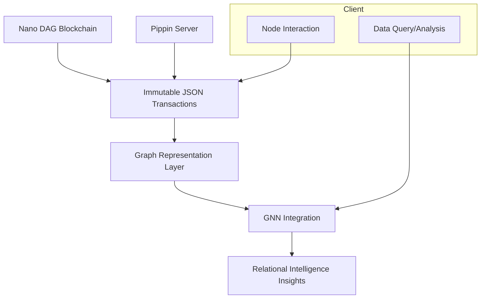

**Decentralized Relational Graph Neural Network (DRGNN)**

**Abstract**

This whitepaper outlines the concept of a Decentralized Relational Graph Neural Network (DRGNN), a novel system leveraging Nano’s Directed Acyclic Graph (DAG) blockchain as an immutable layer for graph data storage and querying. By encoding JSON data into transactions, this system creates a decentralized, verifiable structure for managing relational data while integrating graph neural network (GNN) methodologies for advanced analysis. The system builds on prior work with tools like NetworkX and Neo4j to explore how blockchain technology can enhance distributed relational intelligence.

**Introduction**

Graph Neural Networks (GNNs) have shown immense potential in understanding and leveraging complex relational data. Traditional GNN implementations rely on centralized graph databases like Neo4j or in-memory structures like NetworkX. However, these architectures have inherent limitations in trust, immutability, and decentralization.

By combining the strengths of Nano’s DAG blockchain—known for its scalability, speed, and energy efficiency—with the principles of graph databases, this project aims to introduce a decentralized framework. The DRGNN will support:

- Decentralized graph data storage.
- Immutable and verifiable data structures.
- Interoperability with existing GNN frameworks for advanced analytics.
- Reduced reliance on centralized graph systems.

**Core Concepts**

1. **Nano’s DAG Blockchain as a Storage Layer**
   - Each node in the graph corresponds to a Nano transaction, encoding JSON data.
   - Relationships (edges) between nodes are stored as additional metadata within transactions.
   - The immutability of the blockchain ensures data integrity.

2. **Graph Representation**
   - Nodes: Represent entities in the graph. Example: Accounts, data points, or objects.
   - Edges: Represent relationships or transactions between nodes.
   - Metadata: Encoded in JSON, allowing flexible data storage.

3. **Interoperability with Pippin**
   - Pippin serves as the wallet and transaction management layer.
   - APIs enable seamless creation, retrieval, and linking of graph nodes (transactions).

4. **Graph Neural Network Integration**
   - Graph data retrieved from the Nano network is processed using GNN frameworks.
   - Potential use cases include recommendation systems, fraud detection, and knowledge graph reasoning.

**Architecture**

**Workflow**

1. **Data Ingestion**:
   - Nodes and edges are created as Nano transactions using the Pippin API.
   - JSON metadata encapsulates the necessary information for relational understanding.

2. **Storage**:
   - The Nano DAG blockchain serves as the persistent and immutable storage layer.

3. **Querying**:
   - Data is retrieved via Pippin’s APIs.
   - Relational queries reconstruct the graph structure for downstream processing.

4. **Processing**:
   - GNN frameworks process the data, leveraging pre-trained models or real-time learning techniques.

**Use Case: Decentralized Fraud Detection**

Fraud detection in financial systems often relies on identifying anomalous relationships in transactional data. The DRGNN can:

1. Store transactional relationships on the Nano DAG blockchain.
2. Use GNN algorithms to detect anomalous patterns.
3. Provide immutable evidence trails for further investigation.

**Technical Considerations**

1. **Data Encoding**:
   - JSON structures must balance expressiveness with storage efficiency.

2. **Scalability**:
   - Nano’s architecture supports high-throughput transactions but requires efficient indexing for graph reconstruction.

3. **Interoperability**:
   - APIs must align with existing GNN frameworks for seamless integration.

4. **Security**:
   - Private keys must be securely managed to ensure transaction authenticity.

**Future Directions**

1. **Integration with Advanced GNN Models**:
   - Extend beyond basic GNNs to Relational Graph Neural Networks (RGNNs) for more nuanced reasoning.

2. **Enhanced Query Capabilities**:
   - Develop custom query languages for efficient interaction with the graph.

3. **Cross-Network Collaboration**:
   - Explore interoperability with other blockchain ecosystems.

4. **Visualization**:
   - Build intuitive tools for visualizing decentralized graphs.

**References**

1. Callum Maystone’s work on Relational Graph Neural Networks using Neo4j and NetworkX.
2. Nano documentation: https://docs.nano.org/
3. Pippin documentation: https://github.com/appditto/pippin_nano_wallet

**Conclusion**

The DRGNN represents a paradigm shift in how relational data can be managed and analyzed. By leveraging the Nano DAG blockchain’s unique characteristics, this project aims to provide a scalable, decentralized, and secure framework for graph-based relational intelligence. Through innovative integrations and ongoing development, the DRGNN will pave the way for new applications in decentralized systems and artificial intelligence.

