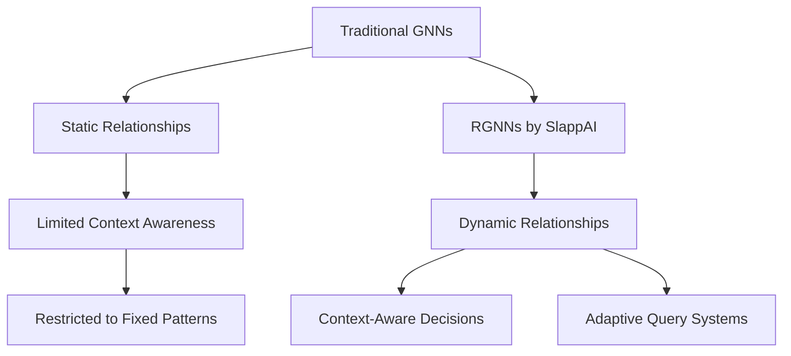
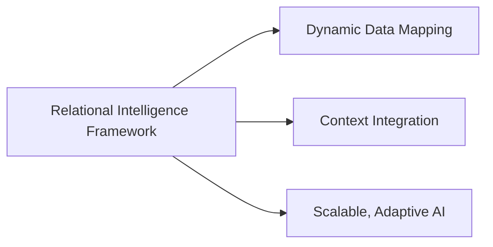
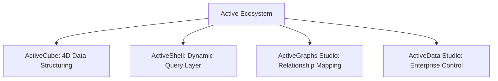
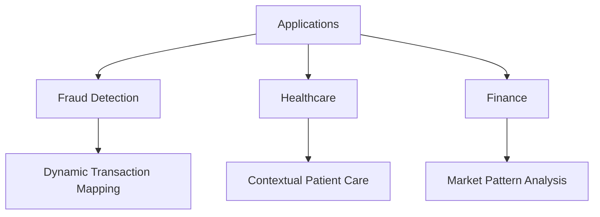
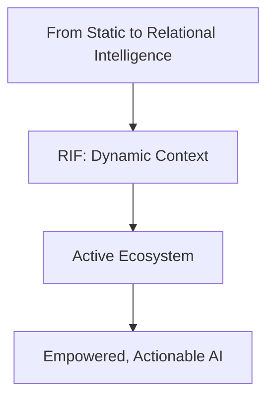

### **Relational Intelligence Framework: Unlocking Contextual AI with the Active Ecosystem**

#### **Introduction**
AI has long been limited by its inability to fully comprehend relationships in data. Traditional models focus on individual entities or static graphs, failing to capture the dynamic and context-rich nature of real-world interactions. To address this, we introduced Relational Neural Networks (RNNs) and Relational Graph Neural Networks (RGNNs), pushing the boundaries of contextual AI.

Building on these foundations, we now unveil the **Relational Intelligence Framework (RIF)** and its practical implementation through the **Active Ecosystem by SlappAI**. This transformative combination bridges theory and application, empowering businesses to unlock the full potential of their data.

---

#### **The Foundations: RNNs and RGNNs**
RNNs and RGNNs revolutionize AI by embedding context into relational models. Here’s how:

1. **Understanding Relationships**: Unlike static graphs, RGNNs map evolving relationships, capturing their dynamic nature.
2. **Context-Aware Insights**: By incorporating time, causality, and external factors, RGNNs enable decisions based on the full picture.
3. **Efficient Querying**: Optimizing blockchain and database queries by embedding relationships directly into the data structure.

---

#### **Introducing the Relational Intelligence Framework (RIF)**
RIF is the next logical step in relational AI. It’s designed to:
- Capture relationships at every level of data.
- Integrate dynamic context into decision-making.
- Provide a framework for scalable, adaptive AI systems.

---

#### **The Active Ecosystem: Bridging Theory and Practice**
The Active Ecosystem by SlappAI brings RIF to life through four core components:

1. **ActiveCube**: Structures data in a 4D space, representing nodes, relationships, context, and time.
2. **ActiveShell**: The dynamic query layer, enabling real-time interactions and actionable insights.
3. **ActiveGraphs Studio**: Helps businesses define and visualize relationships within their data.
4. **ActiveData Studio**: Provides enterprise-level control over data flow, access, and integration.

---

#### **Applications of RIF and the Active Ecosystem**
The synergy between RIF and the Active Ecosystem transforms industries by enabling:
- **Fraud Detection**: Dynamically map transactional relationships over time to identify anomalies.
- **Healthcare**: Optimize patient care by contextualizing medical histories and relationships.
- **Finance**: Enhance risk management by analyzing adaptive market patterns.

---

#### **Conclusion**
The **Relational Intelligence Framework** and the **Active Ecosystem** represent a leap forward in AI. By integrating dynamic relationships, context, and adaptability, we enable businesses to take action on insights they already possess. This is not just a shift in AI capabilities—it’s a new era of relational intelligence.

#### **Call to Action**
We invite researchers, organizations, and visionaries to explore this groundbreaking framework. Together, we can redefine how AI interacts with the world.
