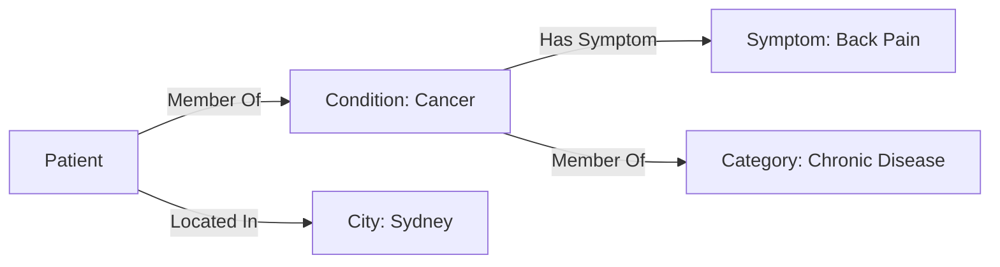
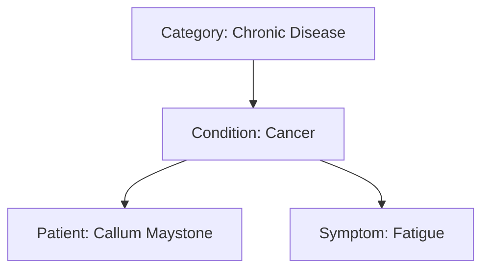
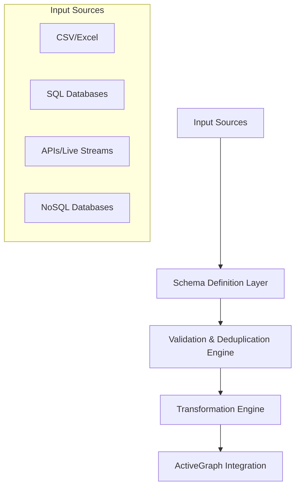
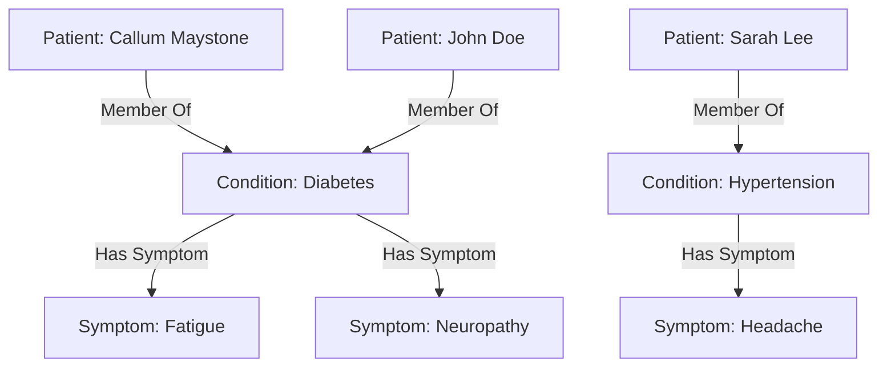
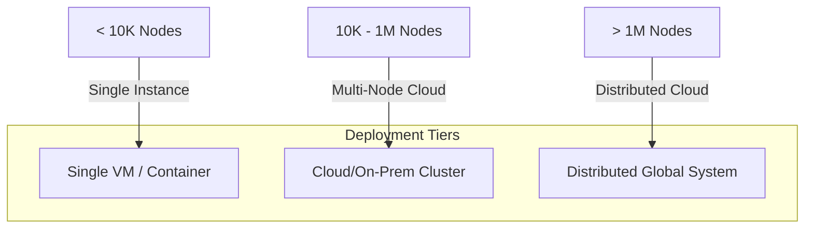

# ActiveData: A Relational Intelligence Ecosystem

---

**Abstract**

ActiveData is a revolutionary ecosystem designed for understanding and leveraging intelligence through dynamic relationships and context. Moving beyond the limitations of traditional relational databases and hierarchical structures, ActiveData utilizes ActiveGraph, ActiveShell, and a Relational API to create systems that are adaptive, scalable, and empowering. Relational Intelligence forms the core principle, by which ActiveData understands intelligence as emerging from the dynamic interplay of connections between data points rather than from isolated data itself. ActiveData empowers organizations and individuals to navigate the complexities of an ever-changing world.

---

### **0. Executive Summary: ActiveData – Redefining Relational Intelligence**

In a world increasingly reliant on data-driven decisions, traditional databases and systems fall short of addressing the complexities of dynamic, real-time relationships. Data today is often stored and processed in silos, treated as isolated points rather than interconnected entities. This fragmented approach limits adaptability, contextual understanding, and ultimately, intelligence.

**ActiveData** is a revolutionary ecosystem that transforms how we understand, manage, and utilize data. At its core lies **Relational Intelligence**—a groundbreaking framework that views intelligence as the result of dynamic, evolving relationships between data points. By prioritizing connections, context, and adaptability, ActiveData empowers organizations to navigate complexity and unlock actionable insights in real time.

Key components of the ActiveData ecosystem include:

1. **ActiveGraph** – A dynamic graph database that captures relationships between entities and evolves with new information.
2. **ActiveShell** – A user-friendly, Noun-Verb-Truth interface that makes querying and managing data accessible to both technical and non-technical users.
3. **Relational API** – A seamless integration layer that connects ActiveData to external platforms while preserving historical context and enabling dynamic insights.
4. **ActiveData Studio** – A visual, interactive environment for exploring and managing relational intelligence, making graphs accessible to all users.

### **Unique Value Proposition**

ActiveData goes beyond static data storage to create **living, breathing systems** that adapt to real-world complexities. Its key innovations include:

- **Dynamic Relationships:** Unlike traditional databases, ActiveData models and evolves connections in real time.
- **Context-Aware Intelligence:** Data is enriched with contextual relationships, enabling deeper insights.
- **Scalability and Flexibility:** The modular design of ActiveData allows it to scale from small projects to enterprise-level systems while adapting to any domain or industry.
- **Accessibility:** ActiveShell's human-readable query syntax democratizes data management, empowering users of all skill levels.

With applications ranging from healthcare and finance to fraud detection and IT infrastructure, ActiveData is a transformative tool for organizations aiming to stay ahead in an ever-changing world. By enabling systems that are not just **intelligent** but also **adaptive and connected**, ActiveData paves the way for a new era of relational intelligence. 

---

**1. Introduction: The Evolution of Data Understanding**

Traditional databases and systems treat data as isolated points, focusing on storage and processing rather than understanding. The result is rigid, inflexible systems that cannot dynamically adapt to real-time data. ActiveData addresses these limitations through Relational Intelligence, which is based on the following tenets:

*   **Relationships as Fundamental:** The dynamic connections between data points are what create intelligence.
*   **Context as Key:** The meaning of data shifts depending on its network of relationships.
*   **Adaptability as Essential:** Intelligent systems should respond in real-time, adapting to changes as they happen.

ActiveData introduces a paradigm shift in how we view and interact with data, enabling a new era of dynamic and connected intelligence.

---

**2. The ActiveData Ecosystem: Key Components**

The ActiveData ecosystem is built on several core components, each contributing to its unique ability to model and manage relational intelligence.

---

**2.1. ActiveGraph: The Dynamic Data Layer**

ActiveGraph is the heart of the system, a dynamic graph database that models relationships between entities in real-time. Unlike traditional relational databases, ActiveGraph treats data not as isolated records but as nodes within an interconnected network. Key aspects include:

*   **Nodes:** Represent individual data entities, acting as both members and containers within the graph. Examples include patients, conditions, symptoms, and categories.
*   **Edges:** Represent dynamic relationships between entities, which can change based on context and time. Edges can represent membership, association, or contextual links.
*   **Dynamic Mapping:**  Relationships are not static; they adapt in real-time based on new information, allowing the system to capture the evolving nature of relationships.
*   **Versatile Modeling:** ActiveGraph can be used to model data structures traditionally handled by RDBMS systems, but with far more flexibility and dynamic adaptability.

---

**2.2. ActiveShell: The Interface for Interacting with Data**

ActiveShell provides a human-interpretable interface for querying, managing, and interacting with the dynamic data stored in ActiveGraph. Key features include:

*   **Noun-Verb-Truth Syntax:** ActiveShell features a powerful, intuitive query language that simplifies complex data interactions.
*   **Dynamic Data Updates:** Users can manage and update relationships and data in real-time using ActiveShell, allowing for immediate adaptation to new information.

---

**2.3. Relational API: Memory and Integration**

The Relational API is designed to ensure seamless integration with external platforms, large language models (LLMs), and applications, while also maintaining context and memory. Key capabilities include:

*   **Integration Middleware:** The API acts as a bridge linking ActiveData to other systems and platforms.
*   **Memory Layer:** The API preserves historical data and context, enabling the system to access past information for dynamic insights.

---

**2.4. ActiveData Studio: Visualizing Relational Intelligence**

ActiveData Studio offers a visual interface for exploring, managing, and interacting with ActiveGraphs. This component is essential for making the system accessible to both technical and non-technical users. Key features are:

*   **Graph Visualization:** The Studio presents data in an easily navigable and understandable format, allowing users to see the connections.
*   **User-Friendly Access:** Provides a visual layer for users to explore and manage graphs, making the system accessible to a wider audience.

---

**2.5. ActiveData Modules: Scalable Expansion**

To ensure scalability and adaptability, ActiveData includes several expandable modules:

*   **ActiveMetrics:** Provides real-time analytics and insights generation, enabling data-driven decision making.
*   **ActiveAutomation:** Enables workflow automation and orchestration based on relational triggers, allowing for dynamic responses to changes in the system.
*   **ActiveAccess:** Provides fine-grained permission management tied to graph relationships, ensuring data security and integrity.

---

### **3. Node-Edge Duality: Mapping Real-World Complexity**

In traditional databases, entities are typically treated as static records, each with a defined role and fixed relationships. However, the real world is far more complex—individuals, objects, and entities often exist in multiple contexts simultaneously and change dynamically over time. **ActiveData's Node-Edge Duality** provides the flexibility and adaptability needed to model this complexity, enabling systems to capture both the fixed and evolving nature of relationships in real time.

---

### **3.1. What is Node-Edge Duality?**

Node-edge duality in ActiveData refers to the ability of nodes (entities) and edges (relationships) to dynamically inherit roles and properties based on their context and position within the graph. 

- **Nodes:** Act as both **containers** of data (e.g., a patient’s personal details) and **members** of relationships (e.g., a patient’s membership in a medical condition).
- **Edges:** Represent the connections between nodes but are not static; they adapt dynamically, inheriting context from their connected nodes.

This duality allows nodes and edges to function as both **independent units** and **integral parts** of a broader, dynamic system.

---

### **3.2. Real-World Example: The Patient as a Node and Edge**

Let’s consider a patient, **Callum Maystone**, as an example to illustrate the power of node-edge duality:

#### **As a Node:**
Callum is represented as a single node with attributes such as:
- **Name:** Callum Maystone
- **Age:** 31
- **Gender:** Male
- **Conditions:** Diabetes, Narcolepsy
- **Address:** Brisbane, Australia

#### **As an Edge:**
Callum is also a participant in multiple relationships, which evolve over time:
- **Membership Relationship:** Callum is a member of the "Diabetes" and "Narcolepsy" conditions.
- **Symptom Relationship:** Callum experiences symptoms such as "Fatigue" and "Gastroparesis."
- **Treatment Relationship:** Callum has an assigned treatment plan connected to his conditions.

#### **Dynamic Context Example:**
When Callum develops a new symptom, "Neuropathy," this relationship is dynamically added to the graph as:
- A new **Symptom Node**: "Neuropathy"
- A new **Edge**: Connecting Callum to "Neuropathy" under the context of "Diabetes."

This allows ActiveData to capture the evolving nature of Callum's medical history without requiring manual restructuring or redefinition of relationships.

---

### **3.3. Property Inheritance in Context**

One of the most powerful aspects of node-edge duality is **property inheritance**. Nodes inherit properties dynamically from parent nodes, providing a rich, context-aware dataset.

#### **Example: A Hierarchical Patient Graph**
Let’s explore Callum’s relationships in a hierarchical structure:

- **Parent Node:** Chronic Diseases (Category)
  - **Child Node:** Diabetes (Condition)
    - **Sub-Child Node:** Callum Maystone (Patient)
      - **Sub-Sub-Child Node:** Fatigue (Symptom)

#### **Inherited Properties:**
- The "Diabetes" condition inherits its category, "Chronic Diseases."
- Callum, as a patient of "Diabetes," inherits its classification as a "Chronic Disease."
- The symptom "Fatigue" inherits its association with both "Diabetes" and Callum.

This hierarchy allows cascading updates:
- If "Diabetes" is reclassified as an "Endocrine Disorder," all associated nodes and edges are dynamically updated.

---

### **3.4. Multi-Role Nodes**

In the real world, entities often play multiple roles simultaneously. ActiveData models this seamlessly through **multi-role nodes**.

#### **Example: A Doctor-Patient Duality**
- A person, **Dr. Sarah Lee**, is represented as a **Doctor Node** and a **Patient Node**:
  - **As a Doctor:** She treats multiple patients, represented by edges connecting her to their conditions.
  - **As a Patient:** She is a member of the "Diabetes" condition, with symptoms and treatment relationships.

#### **Dynamic Edge Adaptation:**
If Dr. Lee becomes a specialist in "Diabetes," her role as a doctor dynamically influences her connections to "Diabetes" patients, enriching the graph with additional context.

---

### **3.5. Real-Time Cascading Updates**

ActiveData ensures that changes to one part of the graph cascade dynamically across all relevant nodes and edges. This reflects the interdependence of relationships in real-world systems.

#### **Scenario: Updating a Condition**
When new research classifies "Diabetes" as a risk factor for "Cardiovascular Disease," the following updates occur:
1. **New Edge Created:** A link is added between "Diabetes" and "Cardiovascular Disease."
2. **Cascading Updates:** All patients with "Diabetes" are now dynamically linked to "Cardiovascular Disease" as a potential risk.

This feature ensures that the graph always reflects the most current understanding of relationships.

---

### **3.6. Philosophical Implications: Data as a Living Entity**

The concept of node-edge duality aligns with a broader philosophical shift: **data as a living entity** rather than static information. 

- In traditional systems, data is frozen, unable to adapt to new contexts without manual intervention.
- In ActiveData, every piece of data is alive—capable of adapting, evolving, and interacting dynamically within a network of relationships.

This shift not only improves efficiency but also mirrors the interconnectedness of the real world, enabling systems that **think and adapt like humans.**

---

### **3.7. Practical Benefits of Node-Edge Duality**

- **Dynamic Adaptation:** Seamlessly update relationships and properties in response to new data.
- **Contextual Intelligence:** Understand entities not in isolation but in the context of their relationships.
- **Scalability:** Handle complex, multi-role entities and dynamic relationships at scale.
- **Real-Time Insights:** Instantly reflect changes across the graph for timely, actionable intelligence.

---

By embracing node-edge duality, ActiveData provides a framework that models the richness and complexity of the real world, empowering users to make better decisions, faster.

---

**4. Schema Structure and Relationship Modeling: Linking Data**

---

**4.1. Tables to Graph Mapping**

ActiveData transforms traditional RDBMS tables into dynamic graph structures. The following table lists how data is mapped:

| Table Name  | Attributes                                   | Relationships             | Graph Representation        |
| ----------- | -------------------------------------------- | ------------------------- | --------------------------- |
| Patient     | ID, First Name, Last Name, Phone, Email      | Member of: Conditions  | Patient Node                |
| Condition   | ID, Name, Classification                     | Contains: Patients, Member of: Categories  | Condition Node (Dual Role) |
| Symptom     | ID, Name                                     | Linked to: Conditions | Symptom Node                |
| Category | ID, Name | Contains: Conditions | Category Node (Parent/OU) |

---

**4.2. Example Schema and Relationship Diagram**

The following diagram illustrates the relationships between key nodes within the system:



---

**4.3. Nested Hierarchies and Property Inheritance**

ActiveData's hierarchical organization enables the creation of nested structures where nodes inherit properties from their parents. This creates rich, contextual information.

*   **Hierarchical Structure:** Category → Condition → Patient → Symptom
*   **Example:**
    *   Parent: Category: Chronic Disease
    *   Child: Condition: Cancer
    *   Sub-child: Patient: Callum Maystone
    *   Sub-sub-child: Symptom: Fatigue

The following diagram shows how this hierarchy is structured:



---

**5. Dynamic Relationship Expansion (DRE): Adapting to Change**

The Dynamic Relationship Expansion (DRE) framework plays a key role in refining relationships based on context and policies. It is designed to capture the evolving nature of real-world relationships.

*   **Dynamic Context:** Relationships are not fixed; they can change based on time, location and other context dependent attributes.
*   **Policy-Driven Refinement:** Contextual attributes define the parameters and conditions of specific relationships.
*   **Adaptive Systems:** DRE frameworks are designed to capture data, and learn from the data to improve the understanding of relationships over time.

---

DRE provides the ability to create truly dynamic systems.

---

### **6. Data Ingestion and Transformation: From Raw Data to Relational Graphs**

ActiveData’s ingestion and transformation pipeline is designed to seamlessly convert structured, semi-structured, and unstructured data into dynamic relational graphs. This process enables organizations to integrate data from diverse sources while preserving its context, relationships, and adaptability.

---

### **6.1. Overview of the Data Ingestion Workflow**

The data ingestion process can be summarized in three primary stages:

1. **Input Sources**: Collect data from various formats and sources, including:
   - CSV/Excel files
   - SQL databases
   - NoSQL systems
   - APIs and live data streams

2. **Transformation Engine**: Map and convert raw data into graph structures, preserving relationships and context.
   - Data schemas are interpreted dynamically and mapped to nodes and edges.
   - Duplicate entities are identified and merged to prevent redundant relationships.

3. **Graph Integration**: The transformed data is integrated into ActiveGraph, creating a rich, interconnected graph network.

---

### **6.2. Data Ingestion Architecture**

The following diagram illustrates the architecture of ActiveData’s data ingestion and transformation process:



---

### **6.3. Step-by-Step Transformation Workflow**

#### **Step 1: Define Schema**
- Users define or import a schema that maps data attributes to nodes, edges, and properties.
- Example: A schema file for "Patient Data" might specify:
  - **Nodes**: Patients, Conditions, Symptoms
  - **Edges**: Membership, Has Symptom

#### **Step 2: Ingest Raw Data**
- Data is ingested from source files or databases. For instance:
  - A CSV file with columns `Patient Name`, `Condition`, `Symptom`.
  - A SQL database table with `Doctor`, `Patient`, and `Treatment`.

#### **Step 3: Validate and Deduplicate**
- The validation engine ensures data consistency by:
  - Identifying duplicate records based on attributes (e.g., matching names, IDs).
  - Ensuring data integrity by cross-referencing with existing graph nodes.

#### **Step 4: Transform to Graph Structure**
- The transformation engine maps data into graph structures:
  - Rows are converted into **nodes** (e.g., a patient).
  - Relationships between rows are converted into **edges** (e.g., a patient with a condition).

#### **Step 5: Integrate into ActiveGraph**
- The graph is updated with the new data, dynamically creating or enhancing relationships.
- Changes cascade through the graph, ensuring all derived relationships are updated.

---

### **6.4. Example: Transforming Patient Data**

#### **Input CSV File**

| Patient Name   | Condition  | Symptom       | Location    |
| -------------- | ---------- | ------------- | ----------- |
| Callum Maystone| Diabetes   | Fatigue       | Brisbane    |
| Sarah Lee      | Hypertension | Headache    | Sydney      |
| John Doe       | Diabetes   | Neuropathy    | Melbourne   |

---

#### **Graph Schema Definition**

- **Nodes**:
  - Patient: `Patient Name`, `Location`
  - Condition: `Condition`
  - Symptom: `Symptom`

- **Edges**:
  - Membership: `Patient` → `Condition`
  - Has Symptom: `Condition` → `Symptom`

---

#### **Generated Graph Representation**



---

### **6.5. Real-Time Ingestion with APIs and Streams**

ActiveData also supports real-time ingestion via APIs and data streams:

- **API Integration**: Pulls data from REST or GraphQL APIs.
  - Example: Fetching real-time weather data and linking it to patient conditions (e.g., respiratory issues during high pollen seasons).

- **Stream Processing**: Processes live data streams using platforms like Kafka or Azure Event Hubs.
  - Example: Ingesting IoT device data (e.g., heart rate monitors) to update patient health graphs dynamically.

---

### **6.6. Error Handling and Monitoring**

To ensure reliability, ActiveData incorporates robust error-handling mechanisms:

- **Data Validation Reports**: Highlight inconsistencies (e.g., missing fields, invalid formats).
- **Error Recovery**: Retry failed ingestion attempts or log them for manual intervention.
- **Monitoring Dashboards**: Provide real-time insights into ingestion performance.

---

### **6.7. Advantages of ActiveData's Transformation Process**

- **Seamless Integration**: Supports multiple data formats and sources.
- **Preserved Context**: Maintains the relationships and context of raw data.
- **Scalability**: Handles large-scale datasets with ease, enabling real-time updates.
- **Automation**: Reduces manual effort with automated schema mapping and deduplication.

By providing a streamlined process for data ingestion and transformation, ActiveData ensures that organizations can quickly and effectively harness the power of relational intelligence.

---

### **7.1. Example ActiveShell Queries**

ActiveShell offers a **Noun-Verb-Truth** approach, inspired by PowerShell’s simplicity and readability, enabling users to interact with the data stored in ActiveGraph effectively. Its syntax provides human-readable commands and leverages PowerShell-style filtering, sorting, and looping for intuitive data manipulation.

---

**Query 1: Find all patients with a specific condition, in a specific location**

Retrieve all patients diagnosed with "Cancer" who are located in "Sydney":

```powershell
Get-Node -Type Patient | Where-Object { $_.Condition -eq 'Cancer' -and $_.Location -eq 'Sydney' }
```

---

**Query 2: Find all conditions within a specific category**

List all conditions that fall under the "Chronic Disease" category:

```powershell
Get-Node -Type Condition | Where-Object { $_.Category -eq 'Chronic Disease' }
```

---

**Query 3: Find patients with a symptom of a certain condition**

Retrieve all patients showing the symptom "Fatigue" for a condition:

```powershell
Get-Node -Type Patient | Where-Object { $_.Symptoms -contains 'Fatigue' }
```

---

**Query 4: Add a new patient to the graph**

Add a new patient to the database with specified attributes:

```powershell
New-Node -Type Patient -Attributes @{ 
    Name = 'John Doe'; 
    Age = 45; 
    Gender = 'Male'; 
    Condition = 'Diabetes'; 
    Location = 'Melbourne' 
}
```

---

**Query 5: Update a patient's contact information**

Update the phone number and email address of a specific patient:

```powershell
Update-Node -Type Patient -Id 123 | Set-Property -Phone '0400-123-456' -Email 'john.doe@example.com'
```

---

**Query 6: Delete a patient record**

Remove a patient record by their unique ID:

```powershell
Remove-Node -Type Patient -Id 123
```

---

**Query 7: Summarize patient demographics for a condition**

Aggregate patient demographics, such as gender and average age, for "Hypertension":

```powershell
Get-Node -Type Patient | Where-Object { $_.Condition -eq 'Hypertension' } | Group-Object -Property Gender | ForEach-Object {
    [PSCustomObject]@{
        Gender = $_.Name
        AverageAge = ($_.Group | Measure-Object -Property Age -Average).Average
        TotalPatients = $_.Count
    }
}
```

---

**Query 8: Loop through patients and alert based on age**

Iterate through all patients and print a warning if their age exceeds 65:

```powershell
Get-Node -Type Patient | ForEach-Object {
    if ($_.Age -gt 65) {
        Write-Warning "Patient $_.Name is over 65 years old!"
    }
}
```

---

**Query 9: Find relationships dynamically between patients and conditions**

Extract all relationships between patients and their conditions:

```powershell
Get-Relationship -Type MemberOf | Where-Object { $_.SourceType -eq 'Patient' -and $_.TargetType -eq 'Condition' }
```

---

**Query 10: Identify overlapping conditions among patients**

Find conditions shared by multiple patients:

```powershell
Get-Node -Type Patient | ForEach-Object {
    $_.Conditions | Group-Object | Where-Object { $_.Count -gt 1 } | ForEach-Object {
        Write-Output "Condition $_.Name is shared by $_.Count patients."
    }
}
```

---

**Query 11: Find patients within a geographical radius**

Retrieve all patients within a 50 km radius of "Melbourne":

```powershell
Get-Node -Type Patient | Where-Object { $_.Location -within 50km of 'Melbourne' }
```

---

**Query 12: Create a custom relationship between nodes**

Create a new relationship between a doctor and a patient:

```powershell
New-Relationship -SourceId 789 -TargetId 123 -Type 'Treats'
```

---

**Query 13: Search for patients by multiple conditions**

Retrieve patients with either "Diabetes" or "Hypertension":

```powershell
Get-Node -Type Patient | Where-Object { $_.Condition -in @('Diabetes', 'Hypertension') }
```

---

**Query 14: Chain filters for advanced queries**

Find patients in "Sydney" older than 60 with "Arthritis":

```powershell
Get-Node -Type Patient | Where-Object { $_.Location -eq 'Sydney' -and $_.Age -gt 60 -and $_.Condition -eq 'Arthritis' }
```

---

### **Why ActiveShell?**

ActiveShell enables seamless CRUD (Create, Read, Update, Delete) operations while maintaining human-readable syntax and flexibility. Its integration with filtering, sorting, and looping logic allows complex queries to be expressed succinctly and executed efficiently. 

This approach ensures a consistent and accessible interface for all users, from non-technical staff to advanced data analysts.

These queries are just some examples of what can be achieved using the ActiveShell syntax.

---

**8. Use Cases: Applications in the Real World**

ActiveData is a versatile system with diverse applications.

---

**8.1. Healthcare**

*   **Patient Grouping:** Dynamically group patients by condition, location, or symptoms, allowing for deeper analysis.
*   **Dynamic Diagnosis:** Link symptoms, conditions, and policy for better diagnoses.
*   **Treatment Planning:** Tailored treatment plans using a dynamically created view of the relationship between patients, their symptoms, and their treatments.

---

**8.2. Fraud Detection**

*   **Hidden Relationships:** Find the patterns and connections between entities to analyze fraud.

---

**8.3. IT Infrastructure**

*   **Active Directory Replacement:** Use ActiveData for managing complex dynamic hierarchies with graph-based intelligence, creating more effective systems than traditional Active Directory implementations.

---

### **9. Cloud Architecture: Flexible Deployment for Every Environment**

ActiveData is designed to accommodate a wide range of deployment scenarios, from fully managed cloud environments to on-premise solutions. This flexibility ensures that organizations with varying needs and preferences can leverage the full potential of ActiveData while maintaining compliance, cost-efficiency, and scalability.

---

### **9.1. Deployment Options**

#### **Option 1: Microsoft Azure (Default)**
ActiveData is optimized for Azure’s ecosystem, leveraging its robust infrastructure to ensure high availability, security, and scalability.

- **Key Components**:
  - **Azure Front Door**: Global load balancing and failover.
  - **Azure Web Application Firewall**: Protection against common exploits.
  - **Azure Cosmos DB**: Globally distributed graph database for scalable storage.
  - **Azure Functions**: Serverless execution of workflows.
  - **Azure API Management**: Seamless integration between services.
  - **Azure Blob Storage**: Secure unstructured data storage.

---

#### **Option 2: Amazon Web Services (AWS)**
ActiveData can be deployed on AWS for organizations already utilizing AWS infrastructure.

- **Key Components**:
  - **AWS CloudFront**: Global content delivery and caching.
  - **AWS API Gateway**: API management and routing.
  - **Amazon Neptune**: Graph database for storing nodes and edges.
  - **AWS Lambda**: Serverless compute for workflows.
  - **Amazon S3**: Storage for unstructured data.
  - **AWS Secrets Manager**: Secure management of keys and credentials.

---

#### **Option 3: Google Cloud Platform (GCP)**
Organizations preferring GCP can deploy ActiveData using its services.

- **Key Components**:
  - **Google Cloud Load Balancer**: Load balancing across regions.
  - **Cloud Functions**: Event-driven serverless compute.
  - **Google Cloud Firestore**: Document database for dynamic storage.
  - **Google Cloud Storage**: Secure file storage.
  - **Vertex AI API**: Integration with GCP’s machine learning tools.
  - **Cloud Key Management**: Encryption and credential management.

---

#### **Option 4: On-Premise Deployment**
For companies with stringent compliance or data security requirements, ActiveData supports on-premise deployments.

- **Key Components**:
  - **Kubernetes**: Container orchestration for microservices.
  - **Neo4j**: On-prem graph database for nodes and edges.
  - **Docker**: Containerized deployment for scalability and ease of updates.
  - **Apache Kafka**: Real-time data streaming for ingestion pipelines.
  - **HashiCorp Vault**: On-premise secrets management.

---

### **9.2. Scalability Map**

ActiveData’s architecture is inherently scalable, designed to handle datasets with millions of nodes and edges. Below is a scalability map outlining how the system grows to meet increasing demands:

---

#### **Small-Scale Deployment (Up to 10K Nodes)**
- **Infrastructure**: Single virtual machine or container.
- **Use Case**: Small organizations or pilot projects.
- **Performance**: Sub-second query responses.
- **Recommended DB**: SQLite, Cosmos DB (local emulation), or Neo4j (community edition).

---

#### **Mid-Scale Deployment (10K to 1M Nodes)**
- **Infrastructure**: Multi-node cloud environment or on-prem cluster.
- **Use Case**: Medium-sized businesses or departmental use.
- **Performance**: Low-latency queries with real-time updates.
- **Recommended DB**: Neo4j Enterprise, Cosmos DB, or Amazon Neptune.

---

#### **Enterprise-Scale Deployment (1M+ Nodes)**
- **Infrastructure**: Fully distributed cloud-native system.
- **Use Case**: Large enterprises or global applications.
- **Performance**: High throughput with concurrent queries and dynamic relationship updates.
- **Recommended DB**: Cosmos DB (global distribution), Amazon Neptune, or Google Firestore.

---

### **9.3. Scalability Diagram**



---

### **9.4. Performance Optimization Features**

#### **Distributed Query Processing**
ActiveData distributes queries across nodes and edges to reduce latency and increase throughput. Each query leverages:
- **Parallel Processing**: Splitting tasks across multiple cores or nodes.
- **Query Caching**: Reusing previous results for repeated queries.

#### **Dynamic Resource Allocation**
ActiveData automatically scales resources based on demand:
- **Horizontal Scaling**: Adding more instances or containers to handle increased load.
- **Vertical Scaling**: Allocating more CPU, memory, or storage to existing instances.

#### **Edge Compression and Pruning**
Reduces memory and compute costs by:
- Compressing redundant relationships.
- Pruning unused or low-priority edges dynamically.

---

### **9.5. Security and Compliance**
ActiveData includes features to ensure compliance with data security standards such as GDPR, HIPAA, and CCPA:
- **Data Encryption**: All data is encrypted in transit and at rest.
- **Fine-Grained Access Control**: Permissions are tied to graph relationships (e.g., patients can only access their own records).
- **Audit Trails**: Comprehensive logging and auditing of all data access and modifications.

---

### **9.6. Future Proofing**
ActiveData’s cloud-agnostic architecture ensures long-term flexibility:
- **Seamless Migration**: Move between cloud providers or on-premise environments without data loss or downtime.
- **Integration Ready**: Compatible with emerging technologies like quantum computing and advanced AI models.

---

By offering multiple deployment options and scalability pathways, ActiveData ensures that organizations can tailor the system to meet their unique needs while remaining future-ready.


---

**10. Development Workflow: Building a Dynamic Future**

ActiveData is built using DevOps principles, ensuring a continuous delivery system.

**10.1. UI/UX Design: A User-Centric Approach**

The UI/UX of ActiveData is designed with accessibility and intuitiveness at its core, empowering users of all skill levels.

*   **Simplified Access:** Users can quickly explore, manage, and query data without needing highly specialised technical training.
*   **Customizable Experience:** The system is designed to be highly customizable, so that each user can interact with the system in a way that is effective for them.

**10.2. CI/CD Pipeline: A Continuous Delivery System**

ActiveData is built using a modern CI/CD pipeline which enables for fast, iterative and continuous improvement.
*   **Automated Processes:** New features are rigorously tested and deployed using an automated system, ensuring continuous improvement and fast development.
*   **Agile Iterations**: The system is designed to be scalable and to adapt to rapidly changing requirements, creating a more effective workflow.

**11. Conclusion: The Future of Relational Intelligence**

ActiveData is more than just a database; it's an ecosystem designed to redefine how we approach data. By emphasizing relationships, context, and adaptability, it provides a foundation for creating intelligent systems that empower users and organizations alike. With ActiveData, we're not just managing data; we're harnessing the power of relational intelligence to navigate an increasingly complex world.

**Tagline:** “ActiveData: Redefining Relational Intelligence through Dynamic Hierarchies and Connections.”

**12. Reference Material**

# Supporting Documents for the SlappAI Relational Intelligence Ecosystem

## Articles

- [SlappAI: Redefining Intelligence](https://medium.com/the-first-digit/slappai-redefining-intelligence-b8df6b16c4f8)
- [SlappAI: Active Graphs - The Foundation of Relational Intelligence](https://medium.com/the-first-digit/slappai-active-graphs-the-foundation-of-intelligence-89ec758005bc)
- [SlappAI: Active Graph Networks for Universal Intelligence](https://medium.com/@callum_26623/slappai-active-graph-networks-for-universal-intelligence-332dd6ce63dc)
- [SlappAI: ActiveShell - Noun-Verb-Truth and the Radiance of Connection](https://medium.com/@callum_26623/genesis-noun-verb-truth-and-the-radiance-of-connection-12275f4e7a81)
- [SlappAI: Cube4D - Structured Multi-Dimensional Data](https://medium.com/cognitive-driven-ai-the-future-of-relational/how-i-accidentally-uncovered-a-new-way-to-understand-perfect-numbers-while-building-4d-data-c8328ee98ee8)

## GitHub Repositories

- [ActiveData](https://github.com/ConicuConsulting/ActiveData)
- [ActiveGraphs](https://github.com/ConicuConsulting/ActiveGraphNetworks)
- [ActiveShell](https://github.com/ConicuConsulting/ActiveShell)
- [Cube4D](https://github.com/ConicuConsulting/Cube4D---The-Final-Computer-Framework)


