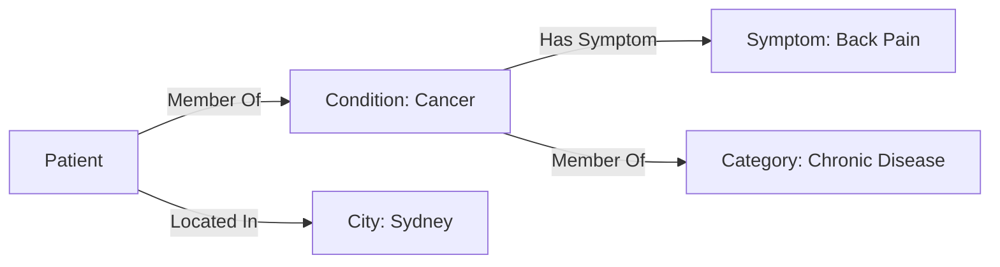
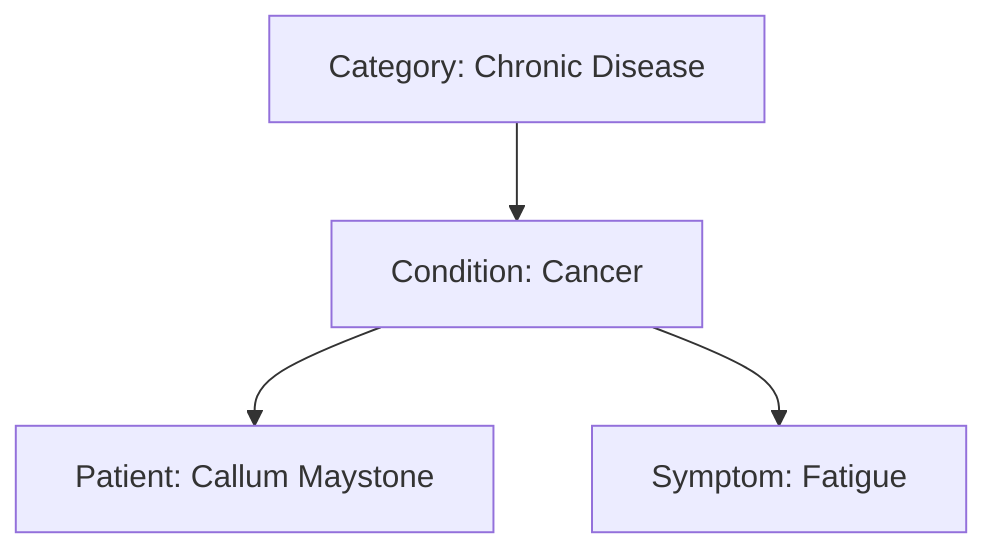

**Whitepaper Title: ActiveData: A Relational Intelligence Ecosystem**

**Abstract**

ActiveData is a revolutionary ecosystem designed for understanding and leveraging intelligence through dynamic relationships and context. Moving beyond the limitations of traditional relational databases and hierarchical structures, ActiveData utilizes ActiveGraph, ActiveShell, and a Relational API to create systems that are adaptive, scalable, and empowering. Relational Intelligence forms the core principle, by which ActiveData understands intelligence as emerging from the dynamic interplay of connections between data points rather than from isolated data itself. ActiveData empowers organizations and individuals to navigate the complexities of an ever-changing world.

**1. Introduction: The Evolution of Data Understanding**

Traditional databases and systems treat data as isolated points, focusing on storage and processing rather than understanding. The result is rigid, inflexible systems that cannot dynamically adapt to real-time data. ActiveData addresses these limitations through Relational Intelligence, which is based on the following tenets:

*   **Relationships as Fundamental:** The dynamic connections between data points are what create intelligence.
*   **Context as Key:** The meaning of data shifts depending on its network of relationships.
*   **Adaptability as Essential:** Intelligent systems should respond in real-time, adapting to changes as they happen.

ActiveData introduces a paradigm shift in how we view and interact with data, enabling a new era of dynamic and connected intelligence.

**2. The ActiveData Ecosystem: Key Components**

The ActiveData ecosystem is built on several core components, each contributing to its unique ability to model and manage relational intelligence.

**2.1. ActiveGraph: The Dynamic Data Layer**

ActiveGraph is the heart of the system, a dynamic graph database that models relationships between entities in real-time. Unlike traditional relational databases, ActiveGraph treats data not as isolated records but as nodes within an interconnected network. Key aspects include:

*   **Nodes:** Represent individual data entities, acting as both members and containers within the graph. Examples include patients, conditions, symptoms, and categories.
*   **Edges:** Represent dynamic relationships between entities, which can change based on context and time. Edges can represent membership, association, or contextual links.
*   **Dynamic Mapping:**  Relationships are not static; they adapt in real-time based on new information, allowing the system to capture the evolving nature of relationships.
*   **Versatile Modeling:** ActiveGraph can be used to model data structures traditionally handled by RDBMS systems, but with far more flexibility and dynamic adaptability.

**2.2. ActiveShell: The Interface for Interacting with Data**

ActiveShell provides a human-interpretable interface for querying, managing, and interacting with the dynamic data stored in ActiveGraph. Key features include:

*   **Noun-Verb-Truth Syntax:** ActiveShell features a powerful, intuitive query language that simplifies complex data interactions.
*   **Dynamic Data Updates:** Users can manage and update relationships and data in real-time using ActiveShell, allowing for immediate adaptation to new information.

**2.3. Relational API: Memory and Integration**

The Relational API is designed to ensure seamless integration with external platforms, large language models (LLMs), and applications, while also maintaining context and memory. Key capabilities include:

*   **Integration Middleware:** The API acts as a bridge linking ActiveData to other systems and platforms.
*   **Memory Layer:** The API preserves historical data and context, enabling the system to access past information for dynamic insights.

**2.4. ActiveData Studio: Visualizing Relational Intelligence**

ActiveData Studio offers a visual interface for exploring, managing, and interacting with ActiveGraphs. This component is essential for making the system accessible to both technical and non-technical users. Key features are:

*   **Graph Visualization:** The Studio presents data in an easily navigable and understandable format, allowing users to see the connections.
*   **User-Friendly Access:** Provides a visual layer for users to explore and manage graphs, making the system accessible to a wider audience.

**2.5. ActiveData Modules: Scalable Expansion**

To ensure scalability and adaptability, ActiveData includes several expandable modules:

*   **ActiveMetrics:** Provides real-time analytics and insights generation, enabling data-driven decision making.
*   **ActiveAutomation:** Enables workflow automation and orchestration based on relational triggers, allowing for dynamic responses to changes in the system.
*   **ActiveAccess:** Provides fine-grained permission management tied to graph relationships, ensuring data security and integrity.

**3. Node-Edge Duality and Property Inheritance: Dynamic Context**

ActiveData utilizes a novel system of node-edge duality and property inheritance, enriching the depth and context of relationships. Key aspects include:

*   **Dual Role of Nodes:** Nodes act as both members and containers within the system, dynamically inheriting properties from their parent nodes.
*   **Dynamic Properties:** Nodes inherit contextual properties from parent containers, and can possess unique properties, creating a dynamic flow of information.
*   **Cascading Changes:** Changes made to parent nodes cascade through the system to all child nodes dynamically and in real time, ensuring that the system is always up to date.

This duality of nodes and property inheritance is designed to build context into the system in a natural way, reflecting the organic interconnectedness of real-world systems.

**4. Schema Structure and Relationship Modeling: Linking Data**

**4.1. Tables to Graph Mapping**

ActiveData transforms traditional RDBMS tables into dynamic graph structures. The following table lists how data is mapped:

| Table Name  | Attributes                                   | Relationships             | Graph Representation        |
| ----------- | -------------------------------------------- | ------------------------- | --------------------------- |
| Patient     | ID, First Name, Last Name, Phone, Email      | Member of: Conditions  | Patient Node                |
| Condition   | ID, Name, Classification                     | Contains: Patients, Member of: Categories  | Condition Node (Dual Role) |
| Symptom     | ID, Name                                     | Linked to: Conditions | Symptom Node                |
| Category | ID, Name | Contains: Conditions | Category Node (Parent/OU) |

**4.2. Example Schema and Relationship Diagram**

The following diagram illustrates the relationships between key nodes within the system:



**4.3. Nested Hierarchies and Property Inheritance**

ActiveData's hierarchical organization enables the creation of nested structures where nodes inherit properties from their parents. This creates rich, contextual information.

*   **Hierarchical Structure:** Category → Condition → Patient → Symptom
*   **Example:**
    *   Parent: Category: Chronic Disease
    *   Child: Condition: Cancer
    *   Sub-child: Patient: Callum Maystone
    *   Sub-sub-child: Symptom: Fatigue

The following diagram shows how this hierarchy is structured:



**5. Dynamic Relationship Expansion (DRE): Adapting to Change**

The Dynamic Relationship Expansion (DRE) framework plays a key role in refining relationships based on context and policies. It is designed to capture the evolving nature of real-world relationships.

*   **Dynamic Context:** Relationships are not fixed; they can change based on time, location and other context dependent attributes.
*   **Policy-Driven Refinement:** Contextual attributes define the parameters and conditions of specific relationships.
*   **Adaptive Systems:** DRE frameworks are designed to capture data, and learn from the data to improve the understanding of relationships over time.

DRE provides the ability to create truly dynamic systems.

**6. Data Ingestion and Transformation: Creating Dynamic Graphs**

ActiveData can ingest data from a variety of sources, including traditional RDBMS databases, and automatically map this into a graph structure.

*   **Schema Definition:** Raw tables are automatically mapped into ActiveGraph nodes and edges.
*   **Dynamic Conversion:** Data is translated into a graph structure, with all relationships and context maintained.

**7. Workflow and Queries: Accessing Relational Intelligence**

Here’s an updated and expanded **ActiveShell Queries** section that follows the **Noun-Verb-Truth** syntax with PowerShell-style filtering and logic:

---

### **7.1. Example ActiveShell Queries**

ActiveShell offers a **Noun-Verb-Truth** approach, inspired by PowerShell’s simplicity and readability, enabling users to interact with the data stored in ActiveGraph effectively. Its syntax provides human-readable commands and leverages PowerShell-style filtering, sorting, and looping for intuitive data manipulation.

---

**Query 1: Find all patients with a specific condition, in a specific location**

Retrieve all patients diagnosed with "Cancer" who are located in "Sydney":

```powershell
Get-Node -Type Patient | Where-Object { $_.Condition -eq 'Cancer' -and $_.Location -eq 'Sydney' }
```

---

**Query 2: Find all conditions within a specific category**

List all conditions that fall under the "Chronic Disease" category:

```powershell
Get-Node -Type Condition | Where-Object { $_.Category -eq 'Chronic Disease' }
```

---

**Query 3: Find patients with a symptom of a certain condition**

Retrieve all patients showing the symptom "Fatigue" for a condition:

```powershell
Get-Node -Type Patient | Where-Object { $_.Symptoms -contains 'Fatigue' }
```

---

**Query 4: Add a new patient to the graph**

Add a new patient to the database with specified attributes:

```powershell
New-Node -Type Patient -Attributes @{ 
    Name = 'John Doe'; 
    Age = 45; 
    Gender = 'Male'; 
    Condition = 'Diabetes'; 
    Location = 'Melbourne' 
}
```

---

**Query 5: Update a patient's contact information**

Update the phone number and email address of a specific patient:

```powershell
Update-Node -Type Patient -Id 123 | Set-Property -Phone '0400-123-456' -Email 'john.doe@example.com'
```

---

**Query 6: Delete a patient record**

Remove a patient record by their unique ID:

```powershell
Remove-Node -Type Patient -Id 123
```

---

**Query 7: Summarize patient demographics for a condition**

Aggregate patient demographics, such as gender and average age, for "Hypertension":

```powershell
Get-Node -Type Patient | Where-Object { $_.Condition -eq 'Hypertension' } | Group-Object -Property Gender | ForEach-Object {
    [PSCustomObject]@{
        Gender = $_.Name
        AverageAge = ($_.Group | Measure-Object -Property Age -Average).Average
        TotalPatients = $_.Count
    }
}
```

---

**Query 8: Loop through patients and alert based on age**

Iterate through all patients and print a warning if their age exceeds 65:

```powershell
Get-Node -Type Patient | ForEach-Object {
    if ($_.Age -gt 65) {
        Write-Warning "Patient $_.Name is over 65 years old!"
    }
}
```

---

**Query 9: Find relationships dynamically between patients and conditions**

Extract all relationships between patients and their conditions:

```powershell
Get-Relationship -Type MemberOf | Where-Object { $_.SourceType -eq 'Patient' -and $_.TargetType -eq 'Condition' }
```

---

**Query 10: Identify overlapping conditions among patients**

Find conditions shared by multiple patients:

```powershell
Get-Node -Type Patient | ForEach-Object {
    $_.Conditions | Group-Object | Where-Object { $_.Count -gt 1 } | ForEach-Object {
        Write-Output "Condition $_.Name is shared by $_.Count patients."
    }
}
```

---

**Query 11: Find patients within a geographical radius**

Retrieve all patients within a 50 km radius of "Melbourne":

```powershell
Get-Node -Type Patient | Where-Object { $_.Location -within 50km of 'Melbourne' }
```

---

**Query 12: Create a custom relationship between nodes**

Create a new relationship between a doctor and a patient:

```powershell
New-Relationship -SourceId 789 -TargetId 123 -Type 'Treats'
```

---

**Query 13: Search for patients by multiple conditions**

Retrieve patients with either "Diabetes" or "Hypertension":

```powershell
Get-Node -Type Patient | Where-Object { $_.Condition -in @('Diabetes', 'Hypertension') }
```

---

**Query 14: Chain filters for advanced queries**

Find patients in "Sydney" older than 60 with "Arthritis":

```powershell
Get-Node -Type Patient | Where-Object { $_.Location -eq 'Sydney' -and $_.Age -gt 60 -and $_.Condition -eq 'Arthritis' }
```

---

### **Why ActiveShell?**

ActiveShell enables seamless CRUD (Create, Read, Update, Delete) operations while maintaining human-readable syntax and flexibility. Its integration with filtering, sorting, and looping logic allows complex queries to be expressed succinctly and executed efficiently. 

This approach ensures a consistent and accessible interface for all users, from non-technical staff to advanced data analysts.

These queries are just some examples of what can be achieved using the ActiveShell syntax.

**8. Use Cases: Applications in the Real World**

ActiveData is a versatile system with diverse applications.

**8.1. Healthcare**

*   **Patient Grouping:** Dynamically group patients by condition, location, or symptoms, allowing for deeper analysis.
*   **Dynamic Diagnosis:** Link symptoms, conditions, and policy for better diagnoses.
*   **Treatment Planning:** Tailored treatment plans using a dynamically created view of the relationship between patients, their symptoms, and their treatments.

**8.2. Fraud Detection**

*   **Hidden Relationships:** Find the patterns and connections between entities to analyze fraud.

**8.3. IT Infrastructure**

*   **Active Directory Replacement:** Use ActiveData for managing complex dynamic hierarchies with graph-based intelligence, creating more effective systems than traditional Active Directory implementations.

**9. Cloud Architecture: Powering ActiveData**

ActiveData is built using a cloud-agnostic architecture designed for scalability, accessibility and security. The core components are deployed using a range of Microsoft Azure services.
*   **Azure Front Door:** Provides a scalable and secure entry point to the web application, to ensure the systems are highly available.
*   **Azure Web Application Firewall:** Protects the system against common exploits.
*   **YouMatter Web App:** A web-based interface, hosted on Azure, that users can use to access data.
*  **Azure API Management**: This component acts as a bridge to allow different components of the system to connect to each other.
*  **BePatientAPI Function App**: Azure functions which power the core logic of the YouMatter application.
*  **Azure Blob Storage**: Used to store unstructured data used by the system.
*  **Azure Cosmos DB**: Used for persistent, scalable storage.
*  **Azure Key Vault**: Used to securely store secrets and API keys.
*   **Azure Application Insights and Azure Monitor:** The system integrates these monitoring tools, to provide full visibility over the performance of the platform.

The following diagram illustrates these key components:


**10. Development Workflow: Building a Dynamic Future**

ActiveData is built using DevOps principles, ensuring a continuous delivery system.

**10.1. UI/UX Design: A User-Centric Approach**

The UI/UX of ActiveData is designed with accessibility and intuitiveness at its core, empowering users of all skill levels.

*   **Simplified Access:** Users can quickly explore, manage, and query data without needing highly specialised technical training.
*   **Customizable Experience:** The system is designed to be highly customizable, so that each user can interact with the system in a way that is effective for them.

**10.2. CI/CD Pipeline: A Continuous Delivery System**

ActiveData is built using a modern CI/CD pipeline which enables for fast, iterative and continuous improvement.
*   **Automated Processes:** New features are rigorously tested and deployed using an automated system, ensuring continuous improvement and fast development.
*   **Agile Iterations**: The system is designed to be scalable and to adapt to rapidly changing requirements, creating a more effective workflow.

**11. Conclusion: The Future of Relational Intelligence**

ActiveData is more than just a database; it's an ecosystem designed to redefine how we approach data. By emphasizing relationships, context, and adaptability, it provides a foundation for creating intelligent systems that empower users and organizations alike. With ActiveData, we're not just managing data; we're harnessing the power of relational intelligence to navigate an increasingly complex world.

**Tagline:** “ActiveData: Redefining Relational Intelligence through Dynamic Hierarchies and Connections.”

**12. Reference Material**

# Supporting Documents for the SlappAI Relational Intelligence Ecosystem

## Articles

- [SlappAI: Redefining Intelligence](https://medium.com/the-first-digit/slappai-redefining-intelligence-b8df6b16c4f8)
- [SlappAI: Active Graphs - The Foundation of Relational Intelligence](https://medium.com/the-first-digit/slappai-active-graphs-the-foundation-of-intelligence-89ec758005bc)
- [SlappAI: Active Graph Networks for Universal Intelligence](https://medium.com/@callum_26623/slappai-active-graph-networks-for-universal-intelligence-332dd6ce63dc)
- [SlappAI: ActiveShell - Noun-Verb-Truth and the Radiance of Connection](https://medium.com/@callum_26623/genesis-noun-verb-truth-and-the-radiance-of-connection-12275f4e7a81)
- [SlappAI: Cube4D - Structured Multi-Dimensional Data](https://medium.com/cognitive-driven-ai-the-future-of-relational/how-i-accidentally-uncovered-a-new-way-to-understand-perfect-numbers-while-building-4d-data-c8328ee98ee8)

## GitHub Repositories

- [ActiveData](https://github.com/ConicuConsulting/ActiveData)
- [ActiveGraphs](https://github.com/ConicuConsulting/ActiveGraphNetworks)
- [ActiveShell](https://github.com/ConicuConsulting/ActiveShell)
- [Cube4D](https://github.com/ConicuConsulting/Cube4D---The-Final-Computer-Framework)


